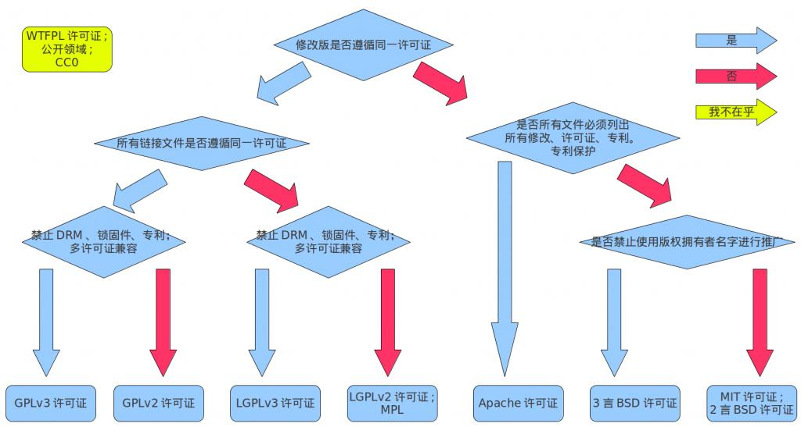

# Warm-up Sweets

本次项目我们来做一些**基本用Python自带的库, 少量代码就能做到**的很有趣的事吧🎉

⭐️ 本次项目要求在**你自己**的账号下建立一个仓库存放代码, 完成后会将大家的仓库列在最下方.

本次热身小项目我们关注Python脚本, 因此以下几点值得思考:

- 如果我有一个脚本**try.py**我该如何运行它? `python try.py`? `./try.py`? 我能不能用`try`来运行我的脚本?
- 如何向Python脚本传递参数?
- 如何让我的脚本依赖尽可能的少?
- 如果我的脚本功能很多, 如何让它容易操作?
- 如何让我的脚本输出更清晰明了?
- 思考编写一个Python脚本和一个Python程序可能有什么不同?

## 备选题目

下面三个是备选题目, 选择其一完成即可, 如果你有兴趣, 三个都完成当然是更好!

此处以表格大致比较了三个题目, 其中**难度**只是相对的, 并且十分主观. **参考代码量**则是参考了我的程序的代码行数, 因为前两个项目可扩展性比较强因此代码行数不确定, 只给出估计的最少行数(算上了为了遵循格式的空行). **关键词**则是解决这个题目所需知识/工具, 方向的提示.

| 项目                                         | 难度               | 参考代码量 | 关键词                              |
| -------------------------------------------- | ------------------ | ---------- | ----------------------------------- |
| [装机向导](setup-wizard/README.md/README.md) | :star:             | 20+        | dict, 调用shell命令, 彩色输出       |
| [随机P站图片壁纸](pixiv-wallpaper/README.md) | :star::star:       | 50+        | 爬虫, requests库, 可个性化参数, try |
| [微信文章搬运小助手](wxcopyer/README.md)     | :star::star::star: | 40         | 正则, 文件读写                      |

## 对项目开发的一些小建议

### 配置一个舒适的开发环境

括号高亮匹配, 缩进高亮, 拼写检查, 多余空格高亮, 折行工具...

⭐️ 推荐VSC插件: [Coding Assist Extension Pack](https://marketplace.visualstudio.com/items?itemName=LeoJhonSong.coding-assist-extension-pack)

### 认真对待README

通常我们会在项目根目录下放一个叫**README.md**的文件.

为什么我们要认真对待README?

💡 此处的README是泛指, 也可能在你项目里是wiki

1. 一份好的REAME应能迅速让人知道你的项目的目的, 用法等, **是人们认识你的项目的入口**. 因此一份好的README很重要.
2. 退一步说也是你在许久后重新捡起这个项目时**快速回忆**的方式
3. 有一个概念叫[**文档先行**](http://tom.preston-werner.com/2010/08/23/readme-driven-development.html), 简单理解就是我们要有的放矢.

🔗 推荐参考资料:

😎 [Awesome README](https://github.com/matiassingers/awesome-readme) 这个仓库里有一串优秀README例子, 有几篇很棒的有关README的文章, 也有几个录制gif的工具推荐之类.

📑 [Art of Readme - Learn the art of writing quality READMEs](https://github.com/noffle/art-of-readme#readme)

⭐️ 推荐VSC插件: [Markdown Extension Pack](https://marketplace.visualstudio.com/items?itemName=LeoJhonSong.markdown-extension-pack)

### 学会增量式开发

> 增量式 (Incremental) 开发的思路, 很适合初学者.

📑 [增量式开发](https://akaedu.github.io/book/ch05s02.html) 👈 这是我曾经看到的一本很不错的书对增量式开发的介绍.

这并不是什么难理解的东西, 说白了就是建议大家**一步一个脚印地开发**.

### 别累着自己

学会在注释里使用**TODO**, **FIXME**等标签

⭐️ 推荐VSC插件: [TODO Tree](https://marketplace.visualstudio.com/items?itemName=Gruntfuggly.todo-tree)

### 体会git, github的妙处

🌟🌟🌟 **GitHub Desktop**有[Linux版](https://github.com/shiftkey/desktop), 如果你不喜欢用命令行操作git, 你可以使用GitHub Desktop来操作托管在GitHub的仓库.

💡 **git和github都不是一两天就能熟悉的东西**, 而且有时候你需要在一个有良好习惯的开发团队里参与一段时间你才能熟悉他们. 直到目前我仍然只会最基础的git和github使用方式, 我的习惯也不够规范. 下面的内容只是让你们有这个意识. 大家可以边了解边实践, 如果**想短时间掌握所有相关知识实在是费力不讨好**. (更何况即便以后我们也不一定用得上所有相关知识)

希望大家通过这一次项目能开始熟悉git和github, 能学着养成一些好习惯, 比如:

- 提交[较为规范的commit message](http://www.ruanyifeng.com/blog/2016/01/commit_message_change_log.html) (这也意味着良好的commit习惯)

  ⭐️ 推荐VSC插件: [Visual Studio Code Commitizen Support](https://marketplace.visualstudio.com/items?itemName=KnisterPeter.vscode-commitizen)

- 思考自己的开源项目应该使用哪个[开源许可证](https://opensource.org/licenses/)? 一图选择开源许可证:point_down:

  

  💡 要注意这个图因为翻译稍有歧义, 图里所有"是否XX"实际上都是"是否**必须**XX"的意思

  🔗 github制作的[许可证详细对比网站](https://choosealicense.com/licenses/)

  🔗 维基百科上的[开源许可证对比词条](https://en.wikipedia.org/wiki/Comparison_of_free_and_open-source_software_licenses)

- 知道, 甚至使用`.gitignore`文件

## 组员项目链接

TODO

